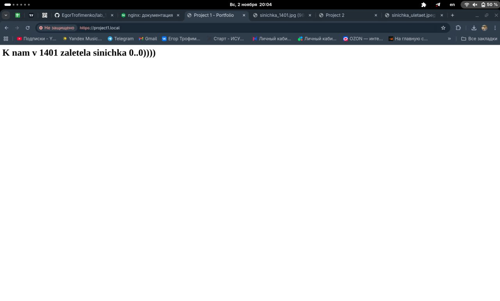
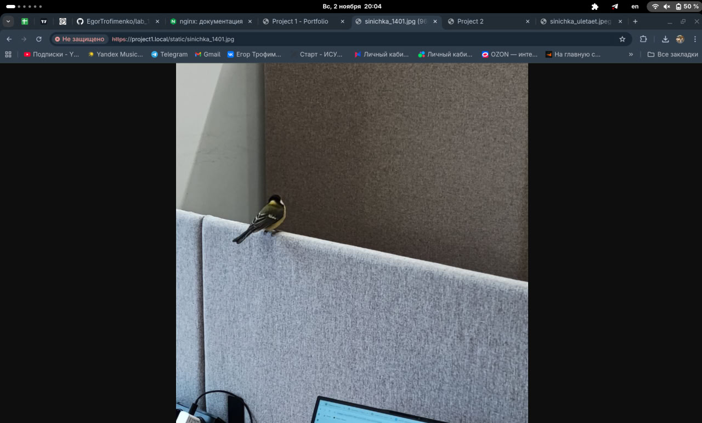
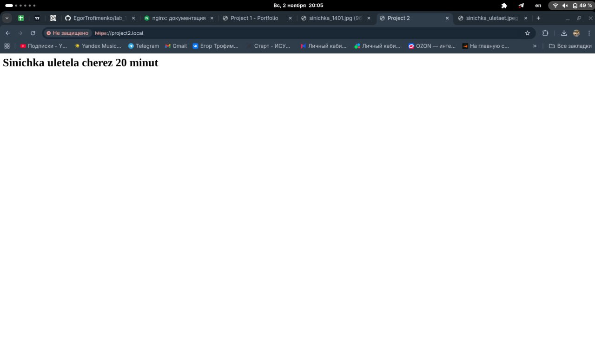
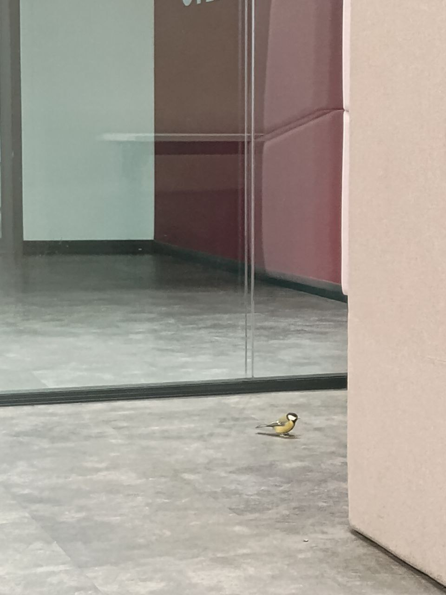

# Лабораторная работа 1: Синичка Edition ⚡ 

* Перед началом выполнения этой работы мы выгнали синичку из коворкинга на Кронве и решили посвятить эту лабу именно ей

## Наши "проекты":
Проект 1:

        <html>
        <head><title>Project 1</title></head>
        <body>
                <h1>K nam v 1401 zaletela sinichka 0..0))))</h1>
        </body>
        </html>``

Проект 2:

    <html>
    <head><title>Project 2</title></head>
    <body>
        <h1>Sinichka uletela cherez 20 minut</h1>
    </body>
    </html>

Их мы поместили в `var/www/project1` и `var/www/project2`, записав как `index.html`

## Alias'ы
Здесь создаем папки, содержимое которых будет доступно по адресу `http://project1.local/static/filename`
и `http://project2.local/data/filename`:

        sudo mkdir -p /var/www/project1/static
        sudo mkdir -p /var/www/project2/data
и потом загружаем в них картинки синички

### Чтобы открывать alias'ы, нужно отредактировать config каждого проекта:
Тут же реализовываем переадресацию на https с порта 80!

Для проекта 1:

        server {
            listen 80;
            server_name project1.local;

            return 301 https://$host$request_uri;
        }

        server {
            listen 443 ssl;
            server_name project1.local;

            ssl_certificate     /etc/nginx/ssl/project1.crt;
            ssl_certificate_key /etc/nginx/ssl/project1.key;

            root /var/www/project1;
            index index.html;

            location / {
                try_files $uri $uri/ =404;
            }

            location /static/ {
                alias /var/www/project1/static/;# <- вот тут указан путь к картинке с синичкой
            }
        }
для второго проекта аналогично:

        server {
            listen 80;
            server_name project2.local;

            return 301 https://$host$request_uri;
        }

        server {
            listen 443 ssl;
            server_name project2.local;

            ssl_certificate     /etc/nginx/ssl/project2.crt;
            ssl_certificate_key /etc/nginx/ssl/project2.key;

            root /var/www/project2;
            index index.html;

            location / {
                try_files $uri $uri/ =404;
            }

            location /data/ {
                alias /var/www/project2/data/;
            }
        }

### Создаем самоподписанные сертификаты
Это мера безопасности. Из-за того, что они самоподписанные, при открытии адреса в браузере выскакивает сообщение об опасности. Но мы знаем его причину, поэтому игнорируем:

            sudo mkdir -p /etc/nginx/ssl
            cd /etc/nginx/ssl

            sudo openssl req -x509 -nodes -days 365 -newkey rsa:2048 \
            -keyout project1.key -out project1.crt \
            -subj "/C=RU/ST=SPB/L=SPB/O=ITMO/OU=Lab/CN=project1.local"

            sudo openssl req -x509 -nodes -days 365 -newkey rsa:2048 \
            -keyout project2.key -out project2.crt \
            -subj "/C=RU/ST=SPB/L=SPB/O=ITMO/OU=Lab/CN=project2.local"

### Проверка
Проект 1:

Проект 2:

Все работает!

### Выводы
Пожалуй, самым большим препятствием была среда выполнения работы. Были трудности с WSL и Fedora из-за всяких особенностей, но мы решили остановиться на последнем варианте и перебороли все ограничения и различия между федорой и бубунту.

Эта работа прокачала наши софты и ТЕРПЕНИЕ и мы довольны результатом!

P.S. за вдохновение и силы спасибо синице Сергею! Будь осторожнее