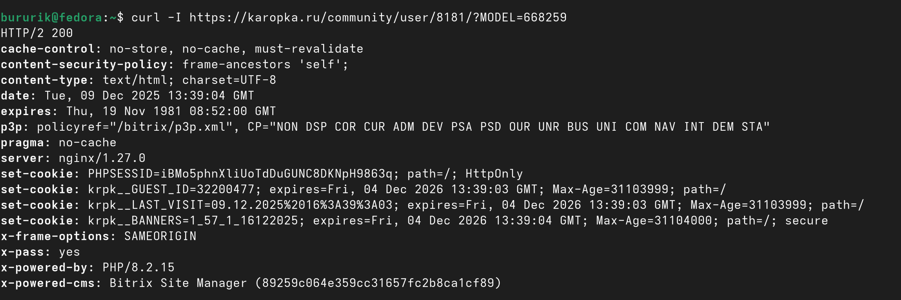
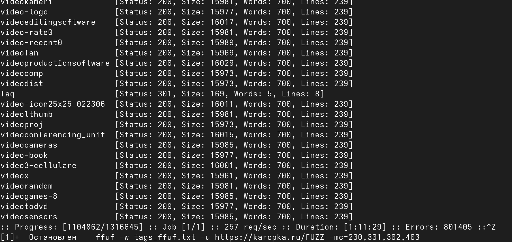
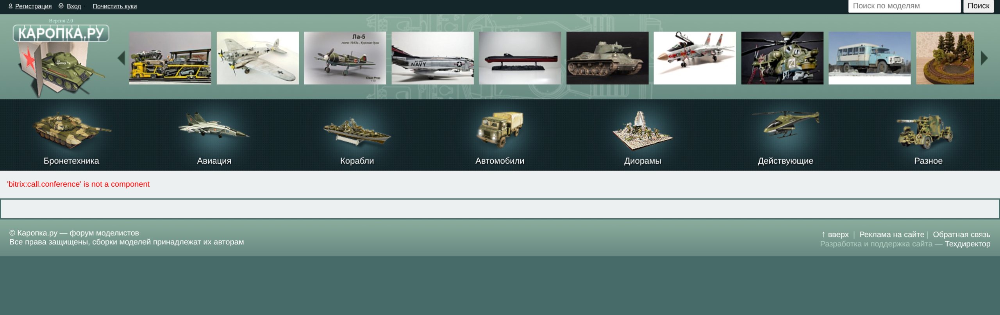
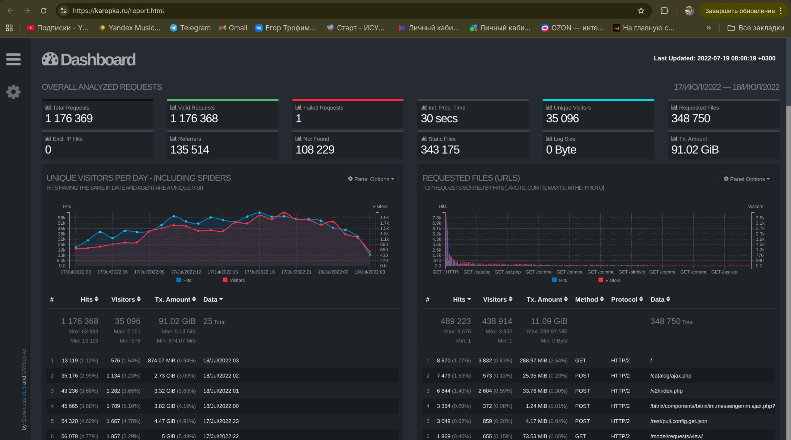
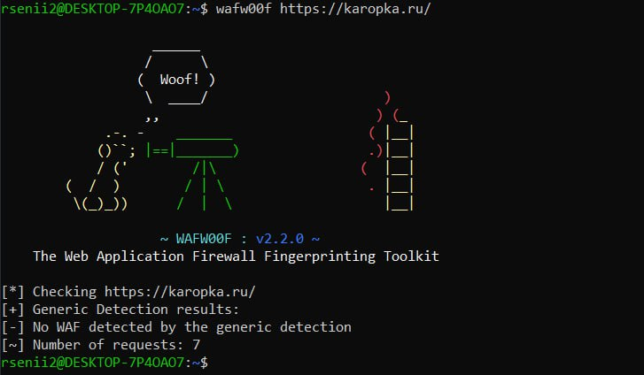
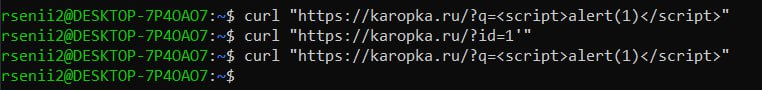

# Лабораторная "Поиск уязвимостей Nginx"

## 1. ffuf

Сначала был установлен ffuf

В качестве подопечного мы выбрали сайт https://karopka.ru - сайт,
на котором люди делятся результатами своих работ над масштабными 
моделями 

При помощи curl мы увидели, что на этом сайте сразу видно много вещей, которые должны быть скрыты от нас, таких, как версии php, nginx итд.

Таким образом, мы пришли к выводу, что у сайта могут быть и другие уязвимости и стали проверять его при помощи ffuf, который установили ранее

Для этой проверки мы использовали данные из репозитория https://github.com/danielmiessler/SecLists/tree/master/Discovery/Web-Content, взяв три файла и объединив их.

Во время нее мы увидели очень большое количество статус кодов 200

но большая часть из них вела или на те страницы, на которые мы и так можем попасть, или на страницы-заглушки, на которых мы видели одну и ту же картину

Тем не менее, мы посмотрели внимательнее и увидели путь https://karopka.ru/report.html, который вывел нас на дашборд со статистикой по пользователям сайта, по ключевым словам, по которым находится сайт, объёму трафика, географии пользователей и их ОС. Статистика перестала обновляться в июле 2022 года

## 2. WAF защита
Установим модуль и проверим стоит ли защита на сайте

WAF не виден, но это не значит, что его нет. Сайт защищен от SQL и XSS инъкций, а это значит, что стоит хоть какая-то фильтрация

## 3. Path traversal
При попытке выйти за пределы корневой директории мы заметили, что путь 

 ``https://karopka.ru/community/user/../../news/`` изменяется на 
 ``https://karopka.ru/news/ ``

 ``https://karopka.ru/community/user/%252e%252e%252f24294/`` - закодированная попытка path traversal 
вернула базовую страницу. Значит, path traversal не дает результатов.

# Итоги

Самым успешным методом поиска уязвимостей для выбранного сайта стал перебор путей с помощью ffuf, который дал нам возможность достать дашборд с аналитикой, который точно не предназначался для базового пользователя и не находится в sitemap