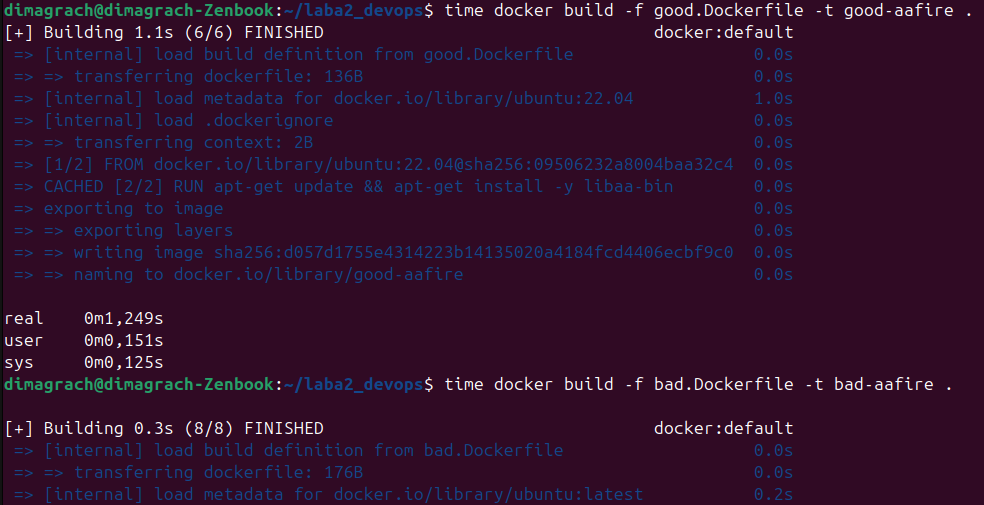
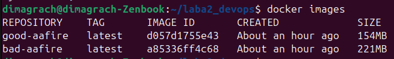

# Лабораторная работа 2: Docker Best Practices у костра

 В первом семестре на информатике в лабораторной работе по докеру мы создавали контейнер для анимированного ASCII-огня. Для этой лабораторной мы решили снова использовать этот милый костер.

## Плохие и хорошие практики в Dockerfile
Сначала мы написали милый с виду, но на самом деле далеко не лучший bad.Dockerfile.
```
FROM ubuntu:latest

RUN apt-get update
RUN apt-get install -y libaa-bin
RUN apt-get install -y curl wget vim

CMD ["/usr/bin/aafire"]
```

Теперь по порядку разберемся что же с ним не так и как это исправить.

### 1. Использование `latest` тега

**В плохом файле мы пишем `FROM ubuntu:latest`**

Это плохо потому что этот тег указывает на последнюю версию, которая в любой момент может измениться, что может привести к непредсказуемым последствиям. Например, сборка может дать разные результаты на разных версиях или вовсе сломать наше приложение.

**Исправляем на `FROM ubuntu:22.04`**

### 2. Множественные RUN команды

**В плохом файле мы пишем** 
```
RUN apt-get update
RUN apt-get install -y libaa-bin
RUN apt-get install -y curl wget vim
```

Каждый RUN создает новый слой в образе, что увеличивает итоговый размер образа и замедляет его сборку.

**Исправляем на `RUN apt-get update && apt-get install -y libaa-bin`**

### 3. Установка лишних пакетов

**В плохом файле мы устанавливаем ненужные нам пакеты `RUN apt-get install -y curl wget vim`** 

Устанавливая лишние пакеты мы нарушаем принцип минимальности - контейнер должен содержать только то, что нужно для работы приложения. К тому же чем у нас больше пакетов устанавливается, тем менее безопасным и приятным в обслуживании становится наш контейнер.

**Просто удалим лишнюю строку, оставив установку только нужных нам пакетов**

В итоге у нас получается вот такой красивый Dockerfile.
```
FROM ubuntu:22.04

RUN apt-get update && apt-get install -y libaa-bin

CMD ["/usr/bin/aafire"]
```

### Что у нас получилось?
Для начала успешно собрали оба образа


После этого сравним размеры получившихся образов


## Плохие практики по работе с контейнерами

1) Использование непонятных имен контейнеров. То есть запуск контейнеров со случайными именами или без имен. Это плохо потому что в таком случае невозможно понять назначение контейнера по названию, сложно управлять множеством контейнеров и легко можно запутаться при мониторинге.
2) Незавершенные контейнеры. Если контейнер не закрыть, то он будет дальше работать и есть ресурсы системы. В случае накопления большого количества таких контейнеров это может привести к замедленной работе всей системы, либо ее перезапуску. 