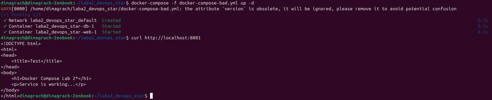
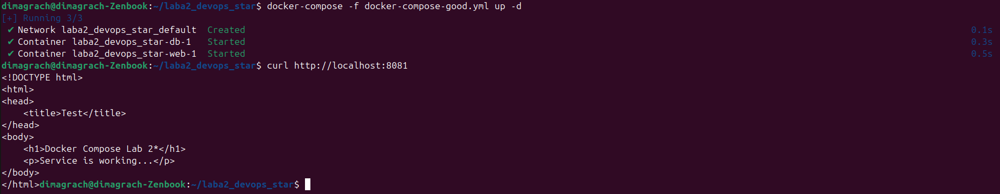
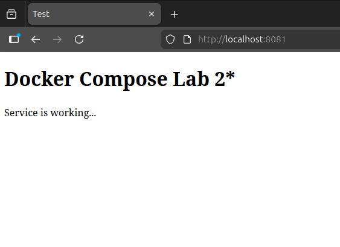
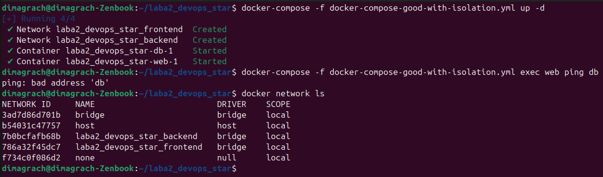

# Лабораторная работа 2*: Docker compose файлы

 Для выполнения лабораторной работы использовали проект, содержащий два сервиса: веб-сервер nginx на порту 8081 и базу данных MySQL.

## Плохие и хорошие практики в Docker compose файлах
Сначала мы написали довольно плохой docker-compose-bad.yml
```
version: '3'
services:
  web:
    image: nginx:latest
    ports:
      - "8081:80"
    environment:
      - PASSWORD=123456
    volumes:
      - ./html:/usr/share/nginx/html
    depends_on:
      - db

  db:
    image: mysql:latest
    environment:
      - MYSQL_ROOT_PASSWORD=qwerty
    restart: always
```

Теперь по порядку разберемся что же с ним не так и как это исправить.

### 1. Использование `version`

**В плохом файле мы пишем `version: '3'`**

Docker Compose по умолчанию использует последнюю спецификацию, а явное указание старой версии вызывает предупреждения.

**Просто удалим эту строчку**

### 2. Использование тегов `latest`

**В плохом файле мы пишем** 
```
image: nginx:latest
image: mysql:latest
```

Использование этого тега может привести к непредсказуемым последствиям, так как последняя версия может в любой момент измениться

**Исправляем на `image: nginx:alpine` и `image: mysql:8`**

### 3. Секреты в коде

**В плохом файле мы пишем**
```
    environment:
      - MYSQL_ROOT_PASSWORD=qwerty
```

Секреты в коде создают критичные уязвимости безопасности. Пароли, видимые в открытом виде, попадают в системы контроля версий, доступны всем разработчикам и сохраняются в истории изменений навсегда. Это приводит к компрометации данных при утечке кода и не позволяет разграничивать доступ между окружениями.
Вынесим секреты в переменные окружения через .env файл, который исключим из репозитория.

**Создадим .env файл и запишем секреты туда, а в хорошем Docker compose файле напишем**

```
    environment:
      - MYSQL_ROOT_PASSWORD=${DB_PASSWORD}
```

### 4. Использование `restart: always`

**В плохом файле мы пишем `restart: always`**

`restart: always` принудительно перезапускает контейнер при любом завершении, включая ручную остановку командой `docker stop`. Это создаёт проблемы управления, то есть невозможно корректно остановить сервис для обслуживания или отладки. Контейнер будет бесконечно перезапускаться, игнорируя административные действия.
Вместо этого будем использовать `restart: unless-stopped`. `restart: unless-stopped` перезапускает контейнер только при аварийном завершении (коды ошибок), но сохраняет состояние остановки, если контейнер был явно остановлен командой `docker stop`.


**Исправим `restart: always` на `restart: unless-stopped`**


В итоге у нас получается вот такой красивый docker-compose-good.yml
```
services:
  web:
    image: nginx:alpine
    ports:
      - "8081:80"
    volumes:
      - ./html:/usr/share/nginx/html
    depends_on:
      - db
    restart: unless-stopped

  db:
    image: mysql:8
    environment:
      - MYSQL_ROOT_PASSWORD=${DB_PASSWORD}
    restart: unless-stopped
```

### Что у нас получилось?
Обе Docker конфигурации успешно собираются и запускаются, сервисы работают в обоих случаях. В случае с плохим Docker compose файлом мы видим предупреждение о версии.





## Изоляция контейнеров
На основе хорошего Docker compose файла был создан новый файл с изолированными контейнерами. 
```
services:
  web:
    image: nginx:alpine
    ports:
      - "8081:80"
    volumes:
      - ./html:/usr/share/nginx/html:ro
    depends_on:
      - db
    networks:
      - frontend
    restart: unless-stopped

  db:
    image: mysql:8
    environment:
      - MYSQL_ROOT_PASSWORD=${DB_PASSWORD}
    networks:
      - backend
    restart: unless-stopped

networks:
  frontend:
    driver: bridge
  backend:
    driver: bridge
```

Теперь Docker создает отдельные виртуальные сети frontend и backend. Контейнер web помещен только в сеть frontend, контейнер db - только в сеть backend. Поскольку они находятся в разных сетях, они не могут общаться напрямую.

